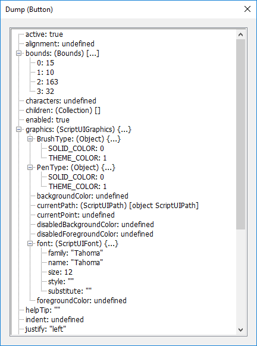
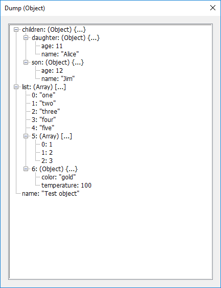

- Dumping of object properties
- Call stack
- Timer
- Summary
- System info

Examples of usage you can test with the `Examples/Debug tools/Debug.jsx` application.

## Dumping

*Dumping of the ScriptUI Button properties:*



*Dump a test object:*

````javascript
// include core Brixy library
#include '../../Brixy/includes/Brixy.jsxinc'
// and debug modules
#include '../../Brixy/includes/debugPack.jsxinc'

// test object
var test = {
	name: 'Test object',
	list: [
		'one', 
		'two', 
		'three', 
		'four', 
		'five', 
		[1, 2, 3], 
		{
			color: 'gold', 
			temperature: 100
		}
	],
	children: {
		son: {
			name: 'Jim',
			age: 12
		},
		daughter: {
			name: 'Alice',
			age: 11
		}
	}
};

// dumping of the test object properties (up to 3 levels of nesting)
BX.debug.dump(test, 3);
````



