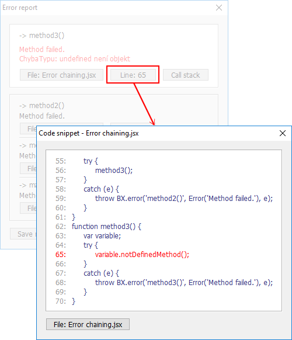
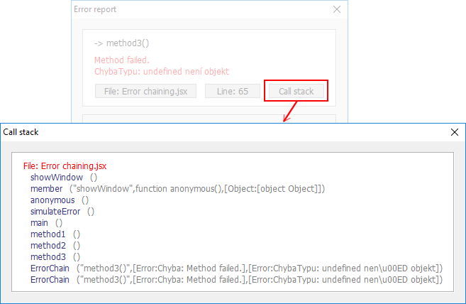
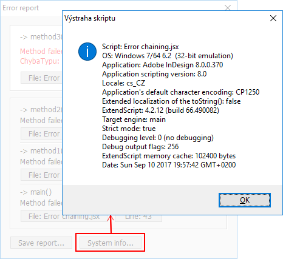

Brixy offers `BX.error` object implementation with the possibility of the error chaining and amazing error reporting.

Example of usage you can test with the `Examples/Debug tools/Error chaining.jsx` application.

*Error report:*

*Code snippet:*

*Call stack:*

*System info:*

