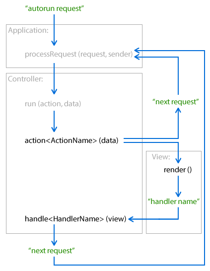

## Birth of application

Applications are born in the _MyApp/config.jsxinc_ file in form of the configuration object that is passed to the application manager. It si method `BX.apps.add(config)`[API](API_LINK/module-_brixy.mvc.AppManager_-AppManager.html#add), where `BX.apps` is instance of the `AppManager`[API](API_LINK/module-_brixy.mvc.AppManager_-AppManager.html) class, `config` is an object according to the `Application`[API](API_LINK/module-_brixy.mvc.Application_-Application.html) specification and may additionally contain `autorun`, `application` and `id` property.

Script may contain more applications.

## Doing jobs

Application receives tasks in the form of requests. **Request** is usually a string that is sent via `BX.apps.processRequest(id, request)`[API](API_LINK/module-_brixy.mvc.AppManager_-AppManager.html#processRequest) method to the application with this `id`.

If application configuration contains the `autorun` property, application manager immediately initializes this application and sends `autorun` request.

## Processing of the request

### Application: `processRequest(request, sender)`[API](API_LINK/module-_brixy.mvc.Application_-Application.html#processRequest)

Brixy framework calls this method for you. You do not care about it.

1. It translates the request to the route. Route object wraps the controller and its action method, optionally some data.
1. Invokes the `run(action, data)`[API](API_LINK/module-_brixy.mvc.Controller_-Controller.html#run) method of the controller.
1. If controller returns a new request, application processes it.

### Controller: `run(action, data)`[API](API_LINK/module-_brixy.mvc.Controller_-Controller.html#run)

Brixy framework calls this method for you. You do not care about it.

1. `action<ActionName>(data)` method of the controller is called here. Controller's subclass should define required action methods, e.g. `actionDefault(data)` for `'Default'` action.
1. Calls `View.render(data)`[API](API_LINK/module-_brixy.mvc.View_-View.html#render) method if controller's action method initializes some view via `setView(view, data)`[API](API_LINK/module-_brixy.mvc.Controller_-Controller.html#setView) method.
1. Calls `handle<HandlerName>(view)` method if your `View.render(data)` method returns a handler name.
1. `run()` method may return the next application request. Application will process it.

### Controller: `action<ActionName>(data)`

You should make this method for each your controller.

1. Controller does the action task in this method. E.g. communicates with the model layer of the application to get and/or set some data.
1. If some user inputs are required, you can call `setView(view, data)`[API](API_LINK/module-_brixy.mvc.Controller_-Controller.html#setView) method to initialize your View class.
1. The action method may return the application request. Controller's `run()` method will return it to the application.

### View: `render(data)`[API](API_LINK/module-_brixy.mvc.View_-View.html#render)

Brixy framework calls this method for you. You do not care about it. Simply define your view class with `render()` method.

1. Shows dialog window to get some data from the user.
1. Method may return the name of the controller's handler. Controller's subclass should define required handler methods, e.g. `handleSave(view)` for `'Save'` handler.

### Controller: `handle<HandlerName>(view)`

You should make this method if you want handle data from the user input.

1. This method finishes the task of the current action after the end of the view rendering. The view with user data is accessible as argument of this method.
1. The handle method may return the application request. Controller's `run()` method will return it to the application.

## Processing of application events

Application **events** are intended for inter-application communication. Script can even publish a method for calling application events from the outside world, e.g. from CEP application.

Events are called via `BX.apps.processEvent(event, data)`[API](API_LINK/module-_brixy.mvc.AppManager_-AppManager.html#processEvent) method. Application manager sends the event to all applications that listens this event.

## The end of the application

Standard script ends when the last application request are finished.

Script running in the persistent Extend Script engine remains alive for the duration of the Adobe application. Application can process requests and events all this time.
